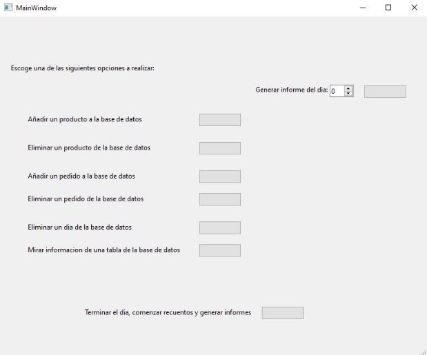

**Manual de uso**

En este manual se especificará cómo utilizar correctamente la aplicación.

Esta es la interfaz de la aplicación, de la cual se explicará el funcionamiento de cada uno de los botones en profundidad

**Inserción de productos**

Al presionar este botón, se generará un Wizard desde el cual introduciremos los datos del producto que queremos añadir a la base de datos.

Como Id del producto deberemos añadir un número entero, como nombre introduciremos una cadena de caracteres y como precio añadiremos un número, ya sea con o sin decimales. Una vez rellenados los datos, se pulsa el botón “Finish”, lo cual en caso de que todos los datos sean del tipo correcto y de que no existiera ningún producto con la Id con la que se pretende insertar el producto nuevo, insertará un producto con estas características en la base de datos,

**Eliminación de un producto**

Al presionar este botón, se generará un wizard desde el cual introduciremos el Id del producto que queremos eliminar de la base de datos.

Simplemente introducimos la Id del producto que queremos eliminar de la base de datos y en caso de que un producto con este Id exista, este será eliminado de la base de datos al pulsar el botón “Finish”.

**Inserción de un Pedido**

Al presionar este botón, se generará un Wizard desde el cual introduciremos los datos del pedido a insertar en la base de datos.

En este wizard, todos los valores a introducir deberán ser números enteros. En caso de que no exista ningún pedido con el mismo Id que hemos seleccionado como Id del pedido y que exista un producto con la Id especificada, un pedido de estas características se generará e introducirá en la base de datos una vez se pulse el botón “Finish”

**Eliminación de un pedido**

Al presionar este botón , se generará un Wizard desde el cual introduciremos el Id del pedido a eliminar.

Simplemente introducimos la Id del pedido que queremos eliminar de la base de datos, y en caso de que exista un pedido con este Id, este pedido será eliminado de la base de datos una vez presionemos el botón “Finish”

**Eliminar los pedidos pertenecientes a un día concreto de la base de datos.**

Este botón generará un Wizard en el cual especificaremos de que dia queremos que se borren los pedidos.

En este Wizard deberemos introducir un número entero, y en caso de que existan pedidos realizados en el dia especificado, este/estos pedidos serán eliminados de la base de datos.

**Consultar los datos de la base de datos.**

Al presionar este botón , se abrirá un Wizard desde el cual podremos decidir de que tabla de la base de datos queremos consultar la información.

En este Wizard habrá una tabla en la que se mostrarán los datos de una tabla en concreto de la base de datos, un selector en el cual podremos seleccionar de qué tabla queremos obtener la información, y un botón, el cual actualiza la tabla con los datos de la tabla seleccionada en el selector

**Generación de informes**

Este botón nos generará un Wizard de varias páginas en el cual elegiremos las opciones con las que se generará el informe.

En esta página escogeremos cual va a ser el trabajador que crea el informe. Deberá recibirse una cadena de caracteres para que se pueda generar correctamente.

En esta pantalla escogeremos el día del cual buscaremos los pedidos y se generará la gráfica a partir de estos pedidos.

Aquí se podrá decidir el color en el que se generará la grafica, siendo las opciones disponibles azul, rojo y negro

En esta pantalla se podrá decidir si el informe que se genere tendrá o no precio. Al darle a generar tendremos un informe que será parecido a este

Por último este botón generaría un informe genérico del día decidido y lo embebería en la aplicación, pero esta funcionalidad no está añadida.
